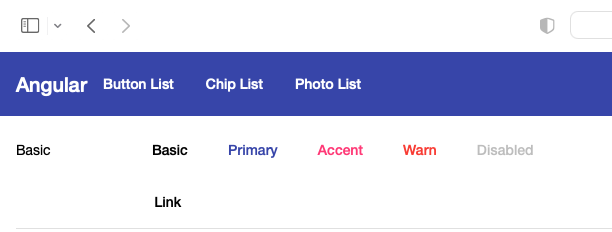
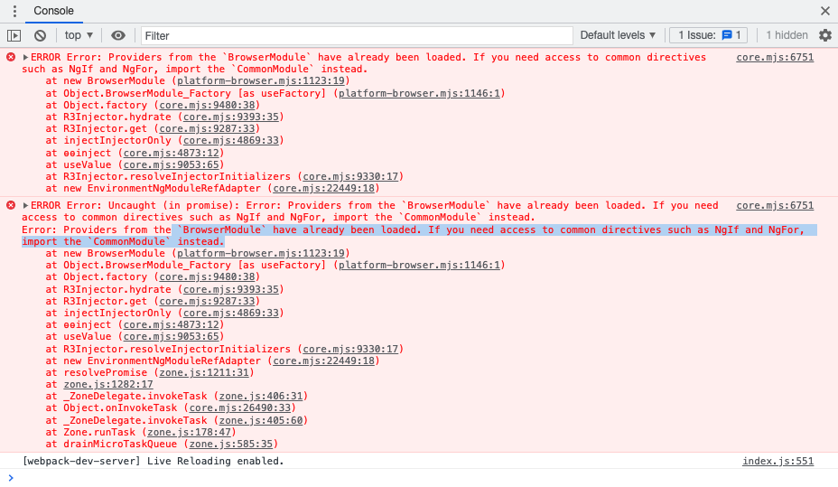

# Angular独立组件简单体验

## 前言

Angular 14一项令人兴奋的特性就是Angular的独立组件终于来了。

在Angular 14中， 开发者可以尝试使用独立组件开发各种组件，但是值得注意的是Angular独立组件的API仍然没有稳定下，将来可能存在一些破坏性更新，所以不推荐在生产环境中使用。

## 如何创建一个独立组件

对于已有的组件，我们可以在`@Component()`中添加*standalone: true*的标识，然后我们可以在没有`@NgModule()`的情况下直接使用`imports`导入其他模块了。
如果是新建组件，可以使用`ng generate component <name> --standalone`的命令，直接创建一个独立组件, 例如：

```bash
ng generate component button-list --standalone
```

```javascript
@Component({
  selector: 'app-button-list',
  standalone: true,
  imports: [
    CommonModule,
  ],
  templateUrl: './button-list.component.html',
  styleUrls: ['./button-list.component.scss']
})
export class ButtonListComponent implements OnInit
```

## 在独立组件中导入已有的模块

我们可以在`imports`中添加已有的模块，以`MatButtonModule`为例：

```typesscript
imports: [
    CommonModule,
    MatButtonModule,
],
```

这样子我们就可以在`ButtonListComponent`中使用`MatButtonModule`的`mat-button`组件了：

```html
<button mat-button>Basic</button>
<button mat-button color="primary">Primary</button>
<button mat-button color="accent">Accent</button>
<button mat-button color="warn">Warn</button>
<button mat-button disabled>Disabled</button>
<a mat-button href="https://damingerdai.github.io" target="_blank">Link</a>
```

效果图：



## 使用独立组件启动Angular应用

第一步， 将`AppComponent`设置为独立组件：

```javascript
@Component({
  selector: 'app-root',
  templateUrl: './app.component.html',
  styleUrls: ['./app.component.scss'],
  standalone: true,
})
export class AppComponent {

```

第二步，将`AppModule`的imports中的导入的模块加入到`AppComponent`的imports中,但是有两个模块例外： `BrowserModule`和`BrowserAnimationsModule`。

如果导入的话，可能会导致** `BrowserModule` have already been loaded. If you need access to common directives such as NgIf and NgFor, import the `CommonModule` instead.**的问题：



第三步，删除`app.module.ts`文件

最后一步， 将`main.ts`中的：

```javascript
import { platformBrowserDynamic } from '@angular/platform-browser-dynamic';
platformBrowserDynamic().bootstrapModule(AppModule)
  .catch(err => console.error(err));
```

改为：

```javascript
bootstrapApplication(AppComponent).catch(err => console.error(err));
```

这样子我们就实现了使用独立组件启动Angular组件了。


## 为独立组件配置路由

我这里分别有三个独立组件： `HomeComponent`, `ButtonListComponent` 和 `ChipListComponent`，

然后在`main.ts`中创建**ROUTES**对象

```typescript
const ROUTES: Route[] = [
  {
    path: '',
    pathMatch: 'full',
    redirectTo: 'home'
  },
  {
    path: 'home',
    component: HomeComponent
  },
  {
    path: 'button',
    loadComponent: () =>
      import('./app/button-list/button-list.component').then(
        (mod) => mod.ButtonListComponent
      ),
  },
  {
    path: 'chip',
    loadComponent: () =>
      import('./app/chip-list/chip-list.component').then(
        (mod) => mod.ChipListComponent
      ),
  },
];
```

其中`ButtonListComponent`和`ChipListComponent`使用`loadComponent`去实现路由懒加载。

然后在`bootstrapApplication`的第二个参数中使用`providers`注册`RouterModule`好了。

```javascript
bootstrapApplication(AppComponent, {
  providers: [
    importProvidersFrom(RouterModule.forRoot([...ROUTES])),
  ],
}).catch(err => console.error(err));
```

效果图：


## 配置依赖注入

当我们想要启动Angular应用的时候，可能需要注入一些值或者服务。 在`bootstrapApplication`, 我们可以通过`providers`来注册值或者服务。

比如，我有一个获取图片的url，需要注入到`PhotoService`中：

```javascript
bootstrapApplication(AppComponent, {
  providers: [
    {
      provide: 'photoUrl',
      useValue: 'https://picsum.photos',
    },
    {provide: PhotosService, useClass: PhotosService },
    importProvidersFrom(RouterModule.forRoot([...ROUTES])),
    importProvidersFrom(HttpClientModule)
  ],
})
```

`PhotoService`代码如下：

```javascript
@Injectable()
export class PhotosService {

  constructor(
    @Inject('photoUrl') private photoUrl: string,
    private http: HttpClient
  ) { }

  public getPhotoUrl(i: number): string {
    return `${this.photoUrl}/200/300?random=${i}`;
  }
}

```

## 源代码

本文所使用的[源代码](https://github.com/damingerdai/angular-standalone-components-app)

线上[demo](https://damingerdai.github.io/angular-standalone-components-app/)

## 参考资料

1. [Angular v14 is now available!](https://blog.angular.io/angular-v14-is-now-available-391a6db736af)
2. [Getting started with standalone components](https://angular.io/guide/standalone-components)
3. [Angular Material](https://material.angular.io/)