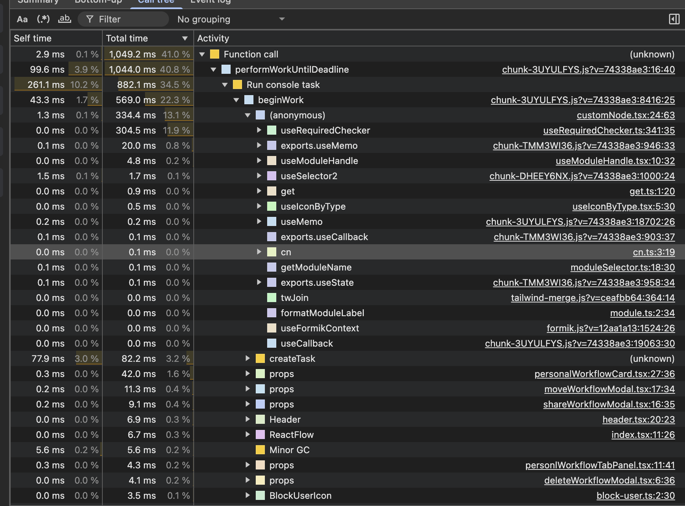

# 🎯 从 3 秒白屏到首屏可见 —— 一次基于 Chrome Performance Call Tree 的深度优化复盘

---

## 一、问题现象

- 页面首次进入白屏约 3 秒
- 300 个 Card 同步渲染
- 每个 Card 内嵌流程图组件
- 数据量 < 1000

现象不是掉帧，而是：

> 页面完全不可见，直到 JS 执行完成。

---

## 二、使用 Chrome DevTools Performance 分析

### 1️⃣ 录制方式

- 打开 Performance 面板
- 录制页面加载过程
- 停止录制
- 切换到 **Call Tree 视图**

---

## 三、关键截图分析（Call Tree）



从 Call Tree 中可以看到几个关键点：

### 🔴 1. 主线程长时间被占用

顶部可以看到：

- `Function call`
- `performWorkUntilDeadline`
- `Run console task`
- `beginWork`

说明：

> 这是一次 React 同步渲染过程。

---

### 🔴 2. React 渲染链路非常清晰

调用栈结构大致如下：

```

performWorkUntilDeadline
└── beginWork
└── customNode.tsx
├── useRequiredChecker
├── useModuleHandle
├── useSelector
├── useFormikContext
└── ...

```

这说明：

- 大量时间消耗在 React Fiber 的 beginWork 阶段
- 组件内部 hook 执行次数非常多
- 每个节点渲染都触发多个 hook

---

### 🔴 3. 重组件被重复执行

从截图中可以看到：

- customNode.tsx
- useRequiredChecker.ts
- useModuleHandle.tsx
- useSelector2
- useFormikContext
- ReactFlow

这说明：

> 每个流程图节点本身就非常重。

而现在：

- 300 个 Card
- 每个 Card 一个 ReactFlow
- 每个 ReactFlow 多个 node
- 每个 node 多个 hook

这是一个典型的：

> 同步重渲染风暴

---

## 四、浏览器角度的本质分析

从 Performance 时间轴可以推断：

- Main Thread 出现长达 ~1000ms+ 的连续执行
- 期间没有明显 idle
- 浏览器无法执行 Paint

浏览器渲染流程：

1. JS 执行
2. Style
3. Layout
4. Paint

问题是：

> JS 执行阶段持续时间过长  
> 浏览器无法进入 Paint 阶段

所以出现：

- 页面白屏
- 直到所有组件 render + commit 完成

---

## 五、React 调度机制的角度

截图中出现：

```

performWorkUntilDeadline

```

这是 React Scheduler 的调度函数。

说明：

- React 正在同步执行任务
- 当前更新优先级较高
- 未被打断

在同步模式下：

- beginWork 会遍历 Fiber 树
- 计算所有子组件
- commit 阶段不可中断

当组件数量 × 单组件复杂度 同时偏大时：

> 很容易形成长任务

---

## 六、关键结论

这次问题不是：

- 数据量大
- 列表太多
- 算法问题

而是：

> 同步渲染了大量 CPU 密集型 UI 组件

这是一个：

> 主线程调度问题

而不是：

> 数据结构问题

---

## 七、方案对比回顾

### ❌ 虚拟列表

- 可以减少数量
- 但改造成本高
- 未必击中根因

---

### ⚠️ 分片渲染

- 可缓解长任务
- 但每片仍包含重组件

---

### ✅ 延迟重组件渲染（最终方案）

核心思想：

1. 让轻内容先完成渲染
2. 重组件延迟到下一帧
3. 使用 Skeleton 占位
4. 打破长任务链路

本质：

> 把 3000ms 的连续长任务拆成多个小任务

让浏览器获得 Paint 机会。

---

## 八、优化后的变化

优化前：

- Main Thread 长时间连续执行
- 无法 Paint
- 白屏 3 秒

优化后：

- 主线程任务被拆散
- 首屏快速可见
- 重组件分布到后续帧
- 用户感知明显改善

注意：

> 总计算量变化不大  
> 但渲染节奏改变了

---

## 九、架构层升维总结

这次优化的本质是：

> 控制 UI 渲染节奏  
> 而不是减少数据量

真正重要的是理解：

- 浏览器渲染模型
- 主线程竞争
- React Fiber 调度
- 长任务对 Paint 的阻塞机制

---

# 🔚 终极总结

性能优化的成熟思维是：

1. 不凭直觉选方案
2. 不迷信虚拟列表
3. 不盲目上并发特性
4. 先看 Call Tree
5. 找到真正的长任务
6. 从调度层面解决问题

当你开始关注：

> 主线程时间片  
> 而不是组件数量  

你就进入了更高维度的性能优化阶段。

