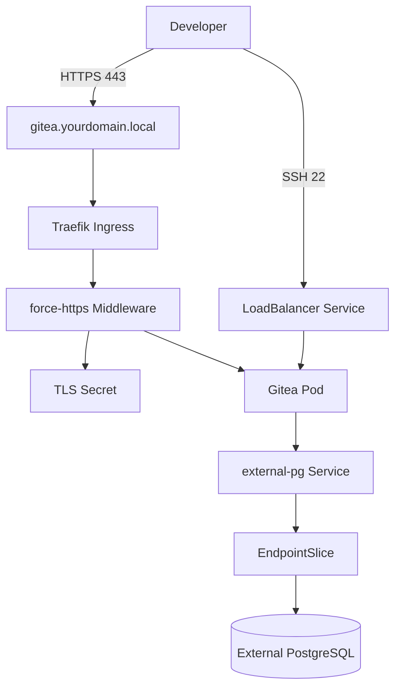

# 🚀 玩转 Homelab：使用 Helm 在 K3s 中部署 Gitea，并接入外部 PostgreSQL

在自己的内网（Homelab）环境里，拥有一个轻量、好用、全加密（HTTPS）的代码托管系统是每个开发者的梦想。今天这篇博客就带大家复盘，如何利用 K3s、Traefik 网关以及外部自建的 PostgreSQL 数据库，一步步搭建属于自己的 Gitea。

我们将摒弃复杂的理论，用最纯粹的实战步骤，带你避开内网部署中的那些“隐藏大坑”。

## 🏗️ 整体架构一览

为了让整个系统足够轻量且好维护，我们采用了以下设计方案：



* 核心服务：Gitea（采用官方轻量化 Rootless 镜像）。

* 数据存储：不使用集群内置的数据库，而是直接连内网独立的 PostgreSQL，实现数据解耦。

* 网络安全：使用内网自签名证书，通过 K3s 自带的 Traefik Ingress 实现 HTTP 自动强转 HTTPS。

* Git 克隆：SSH 流量通过 K8s 的 LoadBalancer 服务直接穿透暴露，确保代码顺畅克隆。

## 

🛠️ 第一步：打通数据孤岛（映射外部数据库）

在集群内部，我们希望像访问集群内服务一样访问外部的 PostgreSQL。这里我们使用 K8s 原生的 Service 和 EndpointSlice 来实现。

> ⚠️ 避坑指南：在 K8s 中，Service 和它的 EndpointSlice 必须处于同一个 Namespace（命名空间）下，否则流量无法正确转发！

创建 external-pg.yaml：

```yaml
apiVersion: v1
kind: Service
metadata:
  name: external-pg
  namespace: gitea # 统一放在 gitea 命名空间, 和helm部署gitea的namespace保持一致就行
spec:
  ports:
    - protocol: TCP
      port: 5432
      targetPort: 5432
---
apiVersion: discovery.k8s.io/v1
kind: EndpointSlice
metadata:
  name: external-pg-slice
  namespace: gitea # 必须与 Service 保持一致！
  labels:
    kubernetes.io/service-name: external-pg
addressType: IPv4
ports:
  - protocol: TCP
    port: 5432
endpoints:
  - addresses: ["192.168.XX.XX"] # 👈 这里填你外部实际的数据库 IP（已做模糊化处理）
```

## 🔑 第二步：安全存储数据库密码

K8s 里的 Secret 用于存放敏感信息。

> ⚠️ 避坑指南：在 stringData 中，如果你的密码全是数字（例如：2026XXXX），必须用双引号 "" 包裹起来！否则 K8s 会把它当成数字类型而报错。

创建 gitea-postgres-secret.yaml：

```yaml
apiVersion: v1
kind: Secret
metadata:
  name: postgres-secret
  namespace: gitea
type: Opaque
stringData:
  password: "你的数据库密码" # 👈 必须加双引号！
```

## 🔄 第三步：创建 Traefik HTTPS 强转中间件

为了让所有访问 http:// 的流量自动跳转到安全的 https://，我们需要给 Traefik 网关配置一个中间件。

创建 gitea-redirect-middleware.yaml：

```yaml
apiVersion: traefik.io/v1alpha1
kind: Middleware
metadata:
  name: force-https
  namespace: gitea # 保持在同一个命名空间
spec:
  redirectScheme:
    scheme: https
    permanent: true # 返回 301 永久重定向
```

## 🔐 第四步：生成内网自签名 TLS 证书

因为我们使用的是内网自定义域名 gitea.yourdomain.local，无法直接通过公网的 Let's Encrypt 签发免费证书，因此我们需要在本地通过 OpenSSL 签发一套私有的 TLS 证书，并将其转存为 K8s 的 Secret 供 Traefik 调度。

我们可以编写一个自动化 Shell 脚本 generate-gitea-secrets.sh 快速搞定这件事：

```bash
#!/bin/bash

# 1. 定义你的内网域名和 K8s 命名空间
DOMAIN="gitea.yourdomain.local"
NAMESPACE="gitea"

echo "==== 正在为 $DOMAIN 生成内网自签名证书 ===="

# 2. 使用 OpenSSL 签发证书（包含 SAN 扩展域名，防止现代浏览器报错）
openssl req -x509 -nodes -days 3650 -newkey rsa:2048 \
  -keyout gitea.key \
  -out gitea.crt \
  -subj "/CN=${DOMAIN}/O=MyHomelab" \
  -addext "subjectAltName = DNS:${DOMAIN}"

echo "==== 正在将证书导入至 K8s Secret ===="

# 3. 确保命名空间存在
kubectl create namespace ${NAMESPACE} --dry-run=client -o yaml | kubectl apply -f -

# 4. 创建 TLS 类型的 Secret
kubectl create secret tls gitea-tls-secret \
  --cert=gitea.crt \
  --key=gitea.key \
  -n ${NAMESPACE} \
  --dry-run=client -o yaml | kubectl apply -f -

echo "==== TLS 证书导入成功！ ===="
```

### 💡 这里的避坑小细节
* -addext "subjectAltName = DNS:..."：这行非常关键！现代浏览器（如 Chrome 和 Safari）对证书的安全审查非常严格。如果证书里没有包含 subjectAltName（简称 SAN）扩展属性，就算你强行信任了证书，浏览器依然会顽固地提示 ERR_CERT_COMMON_NAME_INVALID。

* 有效期 -days 3650：直接给足 10 年有效期，避免内网服务因为证书过期频繁断流。

赋予执行权限并运行它，我们就能在 gitea 命名空间下得到合法的 gitea-tls-secret 了：

```bash
chmod +x generate-gitea-secrets.sh
./generate-gitea-secrets.sh
```

## 📝 第五步：编写核心 Gitea Helm 配置文件

```yaml
# 1. 禁用内置数据库和缓存，走轻量化单机内存模式
postgresql: { enabled: false }
postgresql-ha: { enabled: false }
valkey-cluster: { enabled: false }
valkey: { enabled: false }

# 2. 核心业务与数据库配置
gitea:
  config:
    APP_NAME: "我的内网 Homelab Gitea"
    database:
      DB_TYPE: postgres
      HOST: "external-pg:5432" # 直接使用前面创建的 Service 名字
      NAME: "你的数据库名"
      USER: "你的数据库用户名"
    server:
      ROOT_URL: "https://gitea.yourdomain.local/" # 你的内网域名
      SSH_DOMAIN: "gitea.yourdomain.local"
      SSH_PORT: 22

  # 从刚才创建的 Secret 中动态读取密码
  additionalConfigFromEnvs:
    - name: GITEA__DATABASE__PASSWD
      valueFrom:
        secretKeyRef:
          name: postgres-secret
          key: password

# 3. 数据持久化
persistence:
  enabled: true
  size: 20Gi 

# 4. 网络暴露（HTTP 走内网 Ingress，SSH 走独立四层 LB）
service:
  http:
    type: ClusterIP
    port: 3000
  ssh:
    type: LoadBalancer
    port: 22

# 5. Ingress 路由配置
ingress:
  enabled: true
  className: "traefik"
  annotations:
    kubernetes.io/ingress.class: traefik
    # 绑定强转中间件，格式为：[命名空间]-[中间件名]@kubernetescrd
    traefik.ingress.kubernetes.io/router.middlewares: gitea-force-https@kubernetescrd
  hosts:
    - host: gitea.yourdomain.local
      paths:
        - path: /
          pathType: Prefix
  tls:
    - secretName: gitea-tls-secret # 挂载你的自签名证书
      hosts:
        - gitea.yourdomain.local
```

现在我们可以使用helm命令去部署gitea了：

```bash
helm repo add gitea https://dl.gitea.com/charts/
helm repo update
helm upgrade --install gitea gitea/gitea -f gitea-values.yaml -n gitea
```

## 🚀 第六步：一键部署与避坑复盘

### 1. 数据库的大坑：权限未初始化

在第一次启动时，Gitea 可能会在初始化容器（init-container）处崩溃。查看日志后发现报错：pq: password authentication failed。

原因：外部 PostgreSQL 还没有为 Gitea 创建专属的用户和数据库。

解决办法：登录外部数据库，执行以下 SQL 即可解决：

```SQL
CREATE USER 你的用户名 WITH PASSWORD '你的密码';
CREATE DATABASE 你的数据库名 OWNER 你的用户名;
GRANT ALL PRIVILEGES ON DATABASE 你的数据库名 TO 你的用户名;
```

### 2. 执行安装命令
在执行 Helm 安装时，要先检查本地的仓库别名。如果你的本地仓库别名就叫 gitea，那么命令如下：

```bash
# 更新仓库索引
helm repo update gitea

# 一键安装
helm upgrade --install gitea gitea/gitea \
  -f gitea-values.yaml \
  -n gitea \
  --create-namespace
```

### 3. 网络解析的大坑：DNS 找不到与 Traefik 路由刷新

部署成功后，访问域名可能会遇到两个网络问题：

#### NXDOMAIN 错误：因为是内网域名，公共 DNS 无法解析。

解决办法：在访问网页的电脑上修改 hosts 文件，将域名指向你的 K3s 节点 IP（如 192.168.XX.XX）。

# 🎉 总结
当看到浏览器顶部的绿色小锁（或自签名证书的安全提示），并成功跳转到全加密的 Gitea 欢迎界面时 report，所有的折腾都是值得的！

通过这次实践，我们不仅学会了如何部署一个软件，更深刻理解了 K8s 命名空间隔离、网络路由（Ingress+Middleware）、以及外部资源映射（EndpointSlice） 的底层逻辑。

希望这篇避坑指南能帮到同样在折腾 Homelab 的你！有任何问题，欢迎在评论区留言讨论。 👇